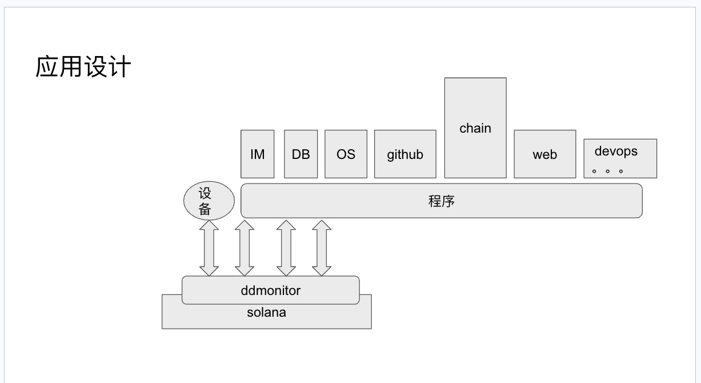

# ddmonitor

Dectentralized data monitor

## 解决问题

- 链上数据空间有限，且使用不够灵活，gas 昂贵
- 链下资源充足. 中心化系统居多，不够透明。
- 线下资源，接入范围限制，接入相对复杂。同时需要维护一个中心节点，同时需要维护稳定性。 
- solana 开发门槛较高

## 怎么解决

- solana 通过智能合约完成数据管理，数据完整性操作
- 依托 solana 的去中心化网络
- 操作历史上链，可追溯，不可篡改
- 使用websocket 完成应用，极大降级开发门槛

## 应用架构

## 开发计划

- 去中心化的方式管理一个中心化数据库。
- IM 实时通信 ， 因为 他是一个数据队列，IM 也是消息传递。
- 构建去中心化的pipeline ，极大的扩展 去中心化的应用
- 和 github action 结合，让solana 集成github 的强大生态。
- 封装成友好的应用接口，降低 dapp 的开发门槛。
- 跨链操作，进一步扩大solana 的生态。
